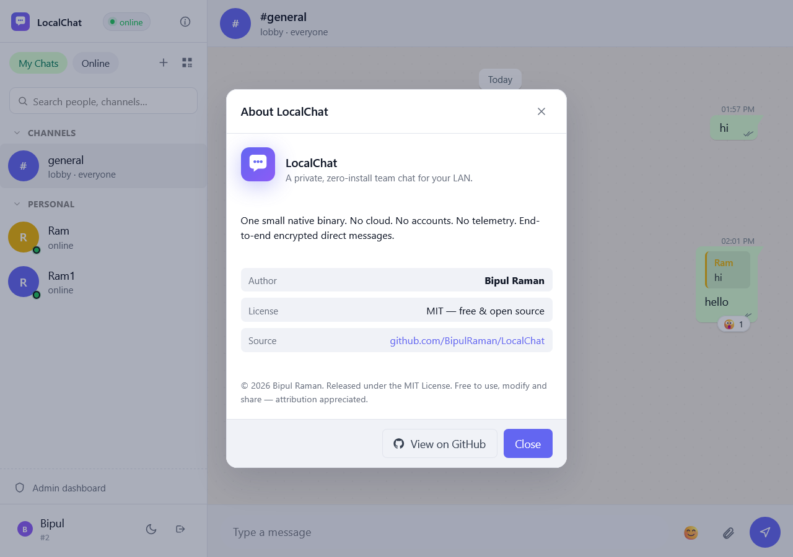
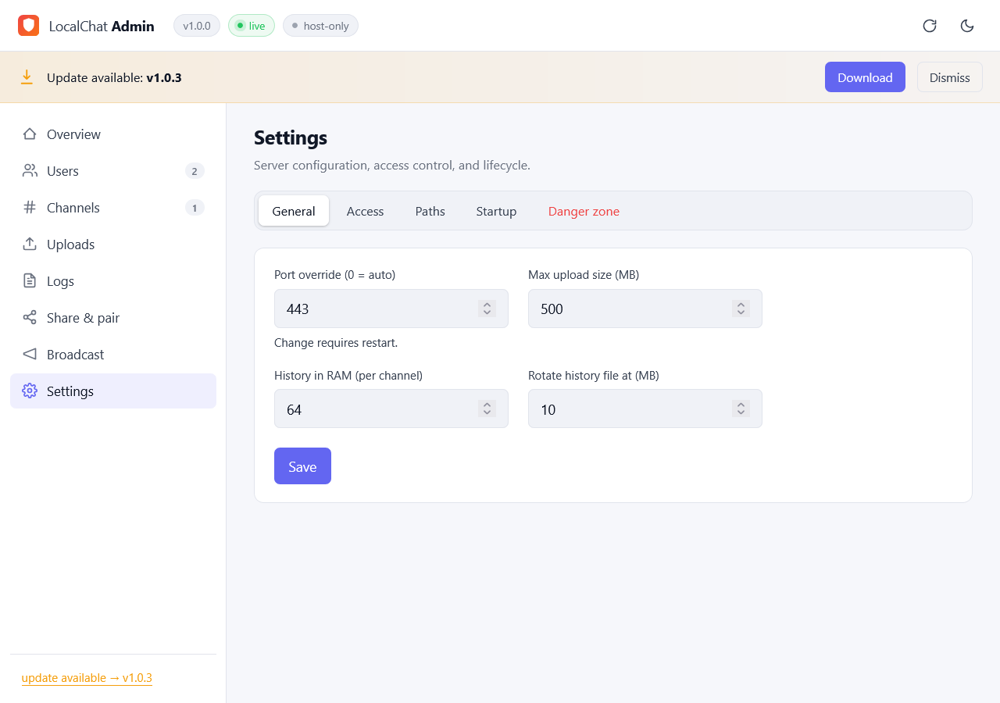

<div align="center">

# LocalChat

**A private, zero-install team chat that runs on your own Wi-Fi.**

One ~5 MB binary. No accounts. No cloud. No telemetry.
Double-click. Share the LAN URL. Done.

[](../../actions/workflows/build.yml)
[](../../releases/latest)


<p>
  
</p>

</div>

---

## Why LocalChat?

Slack and Teams need internet, accounts, and SaaS pricing. IRC needs a server
admin and config files. Discord owns your data.

LocalChat is the missing **fourth option** for offices, classrooms, hackathons,
homelabs, secure facilities, factory floors, ships, planes, and anywhere else
people share a network but not necessarily the internet:

- **One binary, no install.** Drop `LocalChat.exe` on a desktop. Double-click.
  That's the whole setup.
- **Air-gapped friendly.** Zero outbound traffic. Works on a router with no WAN.
- **No accounts.** Pick a name, you're in. Identity is bound to a per-browser
  key so usernames can't be impersonated.
- **End-to-end encrypted DMs.** The host process literally cannot read direct
  messages.
- **Persistent.** Channels, members, message history, reactions and uploads
  survive restarts.
- **Tiny.** ~5 MB on disk, ~5 MB RAM at 200 users / 50 channels.

## Features

| | |
|---|---|
| 💬 **Channels** | Public, private, lobby. Create, invite, join, leave. |
| 🔐 **1:1 DMs** | True end-to-end encryption. |
| 📞 **Voice & video calls** | Direct peer-to-peer between users. |
| 📎 **File sharing** | Drag & drop, image previews, lightbox. |
| ↩️ **Replies & reactions** | Quote any message. React with any emoji. |
| 👋 **Mentions, typing, presence, read receipts** | All the modern niceties. |
| 🛡️ **Admin dashboard** | Live metrics, kick/ban, broadcast, settings. |
| 🌗 **Light & dark themes** | Polished, mobile-friendly UI. |
| 🔁 **Auto-reconnect** | Survives sleep, Wi-Fi roams, network blips. |
| 🚫 **No telemetry** | Not a single outbound request. |

## 60-second quick start

1. Download `LocalChat.exe` from the [latest release](../../releases/latest).
2. Double-click. A tray icon appears; the host's browser opens automatically.
3. Allow it through Windows Firewall (Private network is enough).
4. Read the LAN URL from the tray tooltip — e.g. `https://192.168.1.42:5000` —
   and share it with anyone on the same Wi-Fi.
5. They open the URL, pick a name, and start chatting. No install, no signup.

> 💡 The first visit shows a browser warning because the cert is self-signed.
> Click **Advanced → Proceed**. To replace it with a real cert, see
> [`app/scripts/`](app/scripts/).

## Admin dashboard



Tray → **Open admin dashboard** opens the dashboard with the auto-generated
admin token pre-filled. From there:

- See live metrics (users, messages, uploads, uptime).
- Kick or ban users.
- Broadcast announcements to `#general`.
- View and delete channels and uploaded files.
- Change settings (port, max upload, history cap, autostart on boot,
  allow LAN admin access).

The admin API is **localhost-only by default** and gated by a per-install token.

## Where your data lives

Everything sits in `%APPDATA%\LocalChat\` on Windows (or `$XDG_DATA_HOME/LocalChat`
on Linux/macOS). Want a clean slate? Stop the app, delete the folder, restart.

Override the location with `LOCALCHAT_HOME=D:\path\to\folder`.

## Building from source

```bash
cd app
cargo run --release                          # tray + browser auto-open
cargo build --release --features tray        # produces target/release/localchat.exe
```

CI publishes a single `LocalChat.exe` when you push a tag (`git tag v2.0.0 && git push origin v2.0.0`).

> 🛠️ **Hacking on the internals?** See [`DESIGN.md`](DESIGN.md) for the full
> architecture — concurrency model, persistence layout, E2EE protocol, wire
> spec, and a file-by-file map of the codebase.

## Roadmap

- [ ] macOS & Linux tray builds
- [ ] Mobile-native client (LAN-only, serverless)
- [ ] Group voice/video rooms
- [ ] Slash commands & bots
- [ ] Per-channel notification preferences
- [ ] Searchable history

PRs welcome.

## License

[MIT](LICENSE) — do anything you want; attribution appreciated.

---

<div align="center">

Built with Rust 🦀 because boring infrastructure should be fast and tiny.

</div>